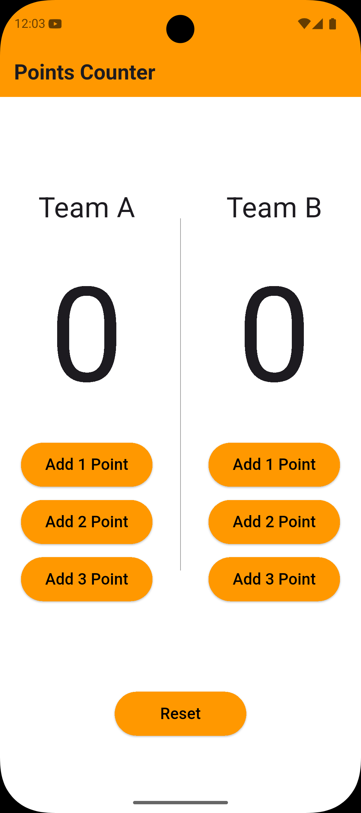
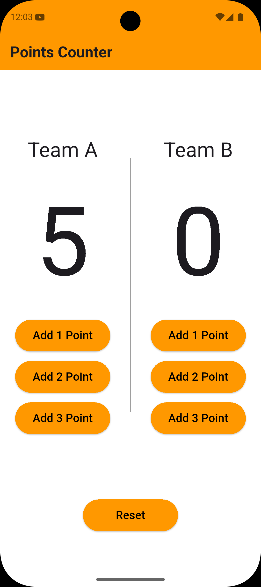
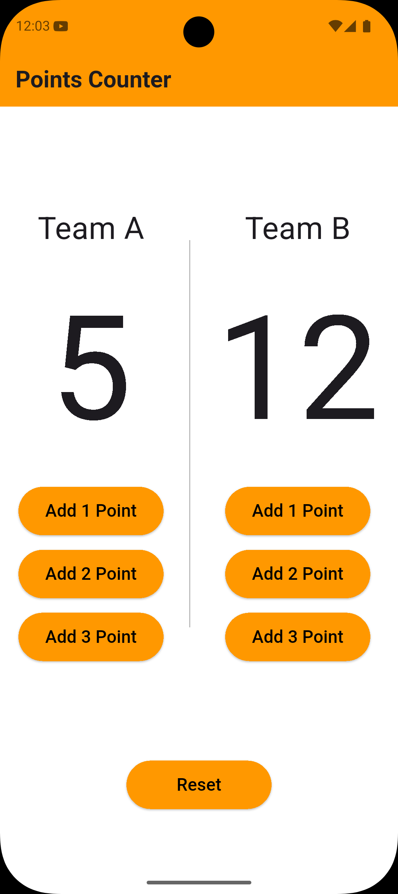

# 🏀 Basketball Counter App

A Flutter application for tracking basketball game points for two teams. Built with clean architecture using the BLoC (Business Logic Component) state management pattern.

---

## ✨ Features

* **Real-time Score Tracking**: Track points for two teams (Team A and Team B)
* **Flexible Scoring**: Add 1, 2, or 3 points with a single tap
* **Large Score Display**: Easy-to-read score display with 150pt font size
* **Reset Functionality**: Reset both team scores to zero
* **Clean UI**: Simple and intuitive interface with orange theme
* **State Management**: Powered by flutter_bloc for predictable state management

---

## 📸 Screenshots

<div align="center">
  
  
  
</div>

---

## 🛠️ Tech Stack

* **Framework**: Flutter (SDK ^3.5.4)
* **State Management**: flutter_bloc ^8.1.2
* **Icons**: cupertino_icons ^1.0.8
* **Language**: Dart

---

## 📁 Project Structure

```
lib/
├── main.dart              # App entry point and BlocProvider setup
├── cubit/
│   ├── counter_cubit.dart # Business logic: score tracking and state emission
│   └── counter_state.dart # State classes for different counter states
└── pages/
    └── home_page.dart     # UI implementation with score display and buttons
```

---

## 🏗️ Architecture

### BLoC Pattern

The app uses the **BLoC (Business Logic Component)** pattern for state management:

* **CounterCubit**: Manages team scores and handles point increments/reset
* **CounterState**: Represents different states (initial, increment, reset)
* **BlocBuilder**: Rebuilds UI when state changes

### Core Logic

* `teamIncrement()` → Adds points (1-3) to the selected team
* `reset()` → Resets both team scores to zero
* Separate state emission for Team A and Team B increments

---

## 🚀 Getting Started

### Prerequisites

Make sure you have the following installed:

* Flutter SDK (^3.5.4)
* Dart SDK
* Android Studio / VS Code
* Xcode (for iOS development)
* Android SDK (for Android development)

---

## ⚙️ Installation

1. Clone the repository:

```bash
git clone <repository-url>
cd basketball_counter_app
```

2. Install dependencies:

```bash
flutter pub get
```

3. Run the app:

```bash
flutter run
```

---

## 📱 Usage

1. Launch the app
2. Tap **"+1 Point"**, **"+2 Points"**, or **"+3 Points"** under each team to add scores
3. View the updated score in the large display
4. Tap **"Reset"** button to start a new game

---

## 🌍 Supported Platforms

* ✅ iOS
* ✅ Android
* ✅ Web
* ✅ Windows
* ✅ Linux
* ✅ macOS

---

## 📦 Dependencies

```yaml
dependencies:
  flutter:
    sdk: flutter
  cupertino_icons: ^1.0.8
  flutter_bloc: ^8.1.2

dev_dependencies:
  flutter_test:
    sdk: flutter
  flutter_lints: ^4.0.0
```

---

## 🛠️ Development

### Run in Debug Mode

```bash
flutter run --debug
```

### Build for Release

**Android**

```bash
flutter build apk --release
```

**iOS**

```bash
flutter build ios --release
```

**Web**

```bash
flutter build web --release
```

---

## 📊 Code Quality

The project uses **flutter_lints** for recommended coding standards.
Analysis options are configured in `analysis_options.yaml`.

---

## 🎯 Future Enhancements

Potential features to add:

* ⏱️ Game timer / stopwatch
* 📊 Score history tracking
* 🏷️ Custom team names
* 📈 Match statistics
* 🌙 Dark mode support
* 🔊 Sound effects when scoring
* 📄 Export score reports

---

## 🤝 Contributing

Contributions are welcome!

1. Fork the repository
2. Create a new branch
3. Commit your changes
4. Open a Pull Request

---

## 📄 License

This project is open source and available for learning and development purposes.

